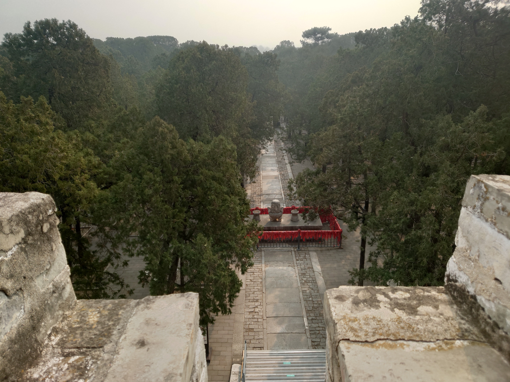
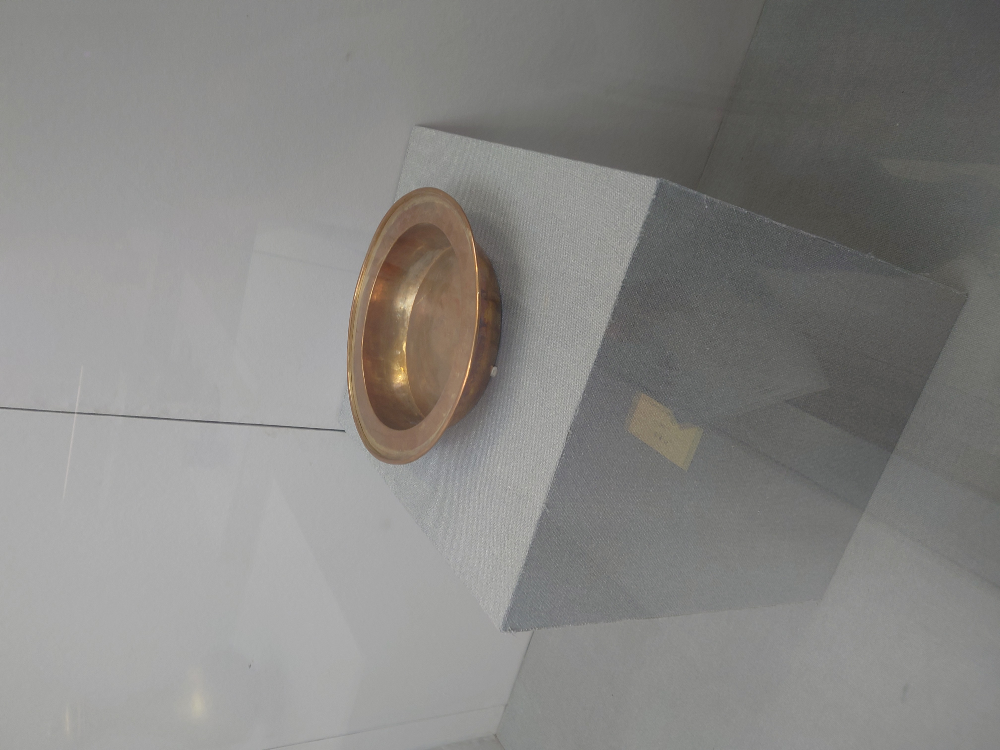

十三陵是明朝十三位皇帝的陵墓群，位于北京市昌平区天寿山麓，是中国古代皇家陵寝建筑的杰出代表。

<!--more-->

## 探访皇陵

今天有幸来到北京十三陵，亲身感受这座有着 600 多年历史的皇家陵园。

## 历史背景

明十三陵建于 1409 年至 1644 年间，是明朝迁都北京后 13 位皇帝的陵墓群。这里环境优美，风水极佳，体现了中国古代"事死如事生"的理念。

### 主要陵墓

- **长陵**：明成祖朱棣陵墓，规模最大
- **定陵**：明神宗朱翊钧陵墓，已发掘
- **昭陵**：明穆宗朱载垕陵墓

## 游览感受

走在神道上，两旁的石像生栩栩如生，仿佛在诉说着那段辉煌的历史。每一座陵墓都承载着深厚的文化底蕴，让人不禁感叹古代工匠的精湛技艺。

## 参观建议

1. **最佳时间**：春秋两季，天气宜人
2. **推荐路线**：长陵 → 定陵 → 昭陵
3. **注意事项**：保持安静，尊重历史文物
4. **交通**：地铁昌平线至昌平站，换乘公交

## 总结

十三陵不仅是一处旅游胜地，更是一部活的历史教科书。在这里，我们可以感受到中华文明的博大精深，体会到古代皇家的威严与荣耀。

值得每一位热爱历史文化的朋友前来探访！
